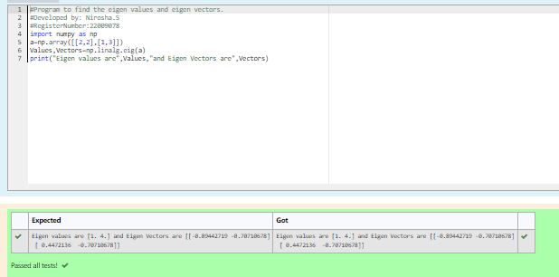

# EIGENVALUES-AND-EIGENVECTORS
## Aim:
To write a python program to find the Eigenvalues and Eigen Vectors
## Equipment’s required:
1. 	Hardware – PCs
2. 	Anaconda – Python 3.7 Installation / Moodle-Code Runner
## Algorithm:

### Step1 : 
Import numpy package
### Step 2: 
Get the input matrix
### Step 3:
 Using the np.linalg.eig(),  we get two results (first is eigenvalue and second is eigenvector) of the given matrix.
### Step 4: 
Print the result
## Program:
```maths
#Program to find the eigen values and eigen vectors.
#Developed by: Nirosha.S
#RegisterNumber:22009078
import numpy as np
a=np.array([[2,2],[1,3]])
Values,Vectors=np.linalg.eig(a)
print("Eigen values are",Values,"and Eigen Vectors are",Vectors)
```
## Output:

## Result:
Thus the Eigenvalue and Eigenvector is successfully solved using python program
